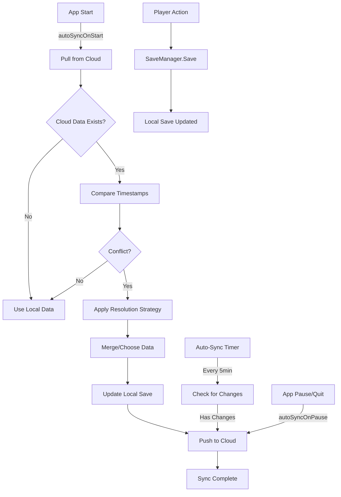

# Cloud Save System Guide

Complete guide for the Robot Tower Defense cloud save system with cross-device sync, conflict resolution, and multiple backend support.

---

## Table of Contents

- [Overview](#overview)
- [Features](#features)
- [Architecture](#architecture)
- [Setup](#setup)
- [Backend Integration](#backend-integration)
- [Conflict Resolution](#conflict-resolution)
- [Usage](#usage)
- [Testing](#testing)
- [Best Practices](#best-practices)
- [Troubleshooting](#troubleshooting)

---

## Overview

The cloud save system enables players to sync their progress across multiple devices. Built with an offline-first design, the system prioritizes local saves and syncs to the cloud when possible.

**File:** `Assets/Scripts/Online/CloudSaveManager.cs` (690 lines)

### Key Characteristics

- **Offline-First**: Local save is always authoritative until synced
- **Automatic Sync**: Configurable auto-sync on start, pause, and intervals
- **Conflict Resolution**: Multiple strategies for handling conflicting saves
- **Backend-Agnostic**: Supports Unity Cloud Save, PlayFab, or custom HTTP backends
- **Non-Blocking**: All cloud operations run asynchronously
- **Intelligent Merging**: Can merge progress from multiple devices

---

## Features

### Core Functionality

✅ **Cross-Device Sync**
- Sync player progress between devices (mobile, tablet, PC)
- Automatic conflict detection and resolution
- Preserves best progress from all devices

✅ **Automatic Syncing**
- On app start (pull cloud data)
- On app pause/quit (push local data)
- Periodic auto-sync (configurable interval, default 5 minutes)
- Manual sync triggers available

✅ **Conflict Resolution Strategies**
- **Most Recent**: Use save with newest timestamp (default)
- **Highest Progress**: Use save with most XP/progress
- **Merge**: Intelligently combine both saves (take best of all values)
- **Prefer Local**: Always use local save
- **Prefer Cloud**: Always use cloud save

✅ **Data Integrity**
- Local backup system (via SaveManager)
- Timestamp validation
- Data hash comparison for change detection
- Graceful fallback if cloud unavailable

### Supported Data

All `PlayerSaveData` fields are synced:
- **Progression**: XP, level, tech points, playtime
- **Statistics**: Total kills, credits, towers placed/upgraded
- **Achievements**: Completed achievements list
- **Maps**: Unlocked maps, per-map best scores
- **Tech Tree**: All upgrade levels
- **Game Modes**: Endless mode, boss rush, daily/weekly stats
- **Settings**: Volume, graphics quality, control preferences

---

## Architecture

### System Flow

```
┌──────────────┐
│ SaveManager  │ ────┐
│ (Local Save) │     │ Auto-notify
└──────────────┘     ▼
                ┌──────────────────┐      ┌──────────────┐
Player Action   │ CloudSaveManager │◄────►│ Cloud Backend│
    ─────────► │   (Sync Logic)   │      │ (Unity/PF/HTTP)│
                └──────────────────┘      └──────────────┘
                     │
                     │ Events: OnSyncCompleted
                     │         OnConflictDetected
                     ▼
                ┌──────────────┐
                │      UI      │
                │ (Status/Sync)│
                └──────────────┘
```

### Key Components

1. **CloudSaveManager** (Singleton)
   - Manages all cloud sync operations
   - Handles conflict resolution
   - Provides sync status and control

2. **SaveManager** (Existing)
   - Handles local file persistence
   - Provides save/load for `PlayerSaveData`
   - Notifies CloudSaveManager of changes

3. **Backend Adapters**
   - Unity Cloud Save adapter
   - PlayFab adapter
   - Custom HTTP adapter

### Sync Cycle



---

## Setup

### 1. Add CloudSaveManager to Scene

**Option A: Automatic Setup (Recommended)**

Add `CloudSaveManager` to your persistent scene (usually MainMenu or Bootstrap):

```csharp
GameObject cloudSaveObj = new GameObject("CloudSaveManager");
cloudSaveObj.AddComponent<CloudSaveManager>();
DontDestroyOnLoad(cloudSaveObj);
```

**Option B: Prefab Setup**

1. Create `CloudSaveManager` prefab in `Assets/Prefabs/Managers/`
2. Add to scene hierarchy
3. Configure in Inspector:
   - ✅ Enable Cloud Save
   - ✅ Auto Sync On Start
   - ✅ Auto Sync On Pause
   - Auto Sync Interval: `300` (5 minutes)
   - Conflict Strategy: `MostRecent`

### 2. Configure Backend

Choose your cloud backend by defining a scripting symbol:

**Unity → Edit → Project Settings → Player → Scripting Define Symbols**

Add one of:
- `UNITY_CLOUD_SAVE` (for Unity Cloud Save)
- `PLAYFAB` (for PlayFab)
- Leave empty (for custom HTTP backend)

### 3. Verify Integration

The CloudSaveManager automatically integrates with SaveManager. No manual hookup required.

---

## Backend Integration

### Option 1: Unity Cloud Save

**Requirements:**
- Unity Services account
- Cloud Save package: `com.unity.services.cloudsave`
- Project linked to Unity Cloud

**Setup:**

1. Install packages:
```
Window → Package Manager → Unity Registry → Cloud Save → Install
Window → Package Manager → Unity Registry → Authentication → Install
```

2. Enable Unity Cloud Save:
```csharp
// Add at top of CloudSaveManager.cs
#define UNITY_CLOUD_SAVE
```

3. Initialize (already implemented in CloudSaveManager):
```csharp
private IEnumerator InitializeUnityCloudSave()
{
    await Unity.Services.Core.UnityServices.InitializeAsync();
    await Unity.Services.Authentication.AuthenticationService.Instance.SignInAnonymouslyAsync();
    Debug.Log("[CloudSaveManager] Unity Cloud Save initialized");
}
```

4. Uncomment Unity Cloud Save methods in `CloudSaveManager.cs`:
   - `InitializeUnityCloudSave()`
   - `PushToCloudInternal()` → Unity implementation
   - `FetchFromCloud()` → Unity implementation

**Cost:** Free tier includes 5 GB storage, 50k DAU

---

### Option 2: PlayFab

**Requirements:**
- PlayFab account and Title ID
- PlayFab SDK for Unity

**Setup:**

1. Install PlayFab SDK:
```
Download: https://github.com/PlayFab/UnitySDK/releases
Assets → Import Package → Custom Package → PlayFabSDK.unitypackage
```

2. Configure Title ID:
```csharp
// In PlayFabSettings or initialization code
PlayFabSettings.TitleId = "YOUR_TITLE_ID";
```

3. Enable PlayFab:
```csharp
// Add at top of CloudSaveManager.cs
#define PLAYFAB
```

4. Uncomment PlayFab methods in `CloudSaveManager.cs`:
   - `InitializePlayFab()`
   - `PushToCloudInternal()` → PlayFab implementation
   - `FetchFromCloud()` → PlayFab implementation

**PlayFab User Data API:**
```csharp
// Push
var request = new UpdateUserDataRequest
{
    Data = new Dictionary<string, string> { { "player_save", json } }
};
PlayFabClientAPI.UpdateUserData(request, OnSuccess, OnError);

// Pull
var request = new GetUserDataRequest();
PlayFabClientAPI.GetUserData(request, OnSuccess, OnError);
```

**Cost:** Free tier includes 100k DAU

---

### Option 3: Custom HTTP Backend

**Requirements:**
- HTTP server with save/load endpoints
- Player authentication system

**Implementation:**

1. Set up server endpoints:
```
POST /api/save    - Upload player save data
GET  /api/save    - Download player save data
```

2. Implement in CloudSaveManager.cs (Custom Backend region):

```csharp
private IEnumerator PushToCloudInternal(Core.PlayerSaveData data)
{
    string json = JsonUtility.ToJson(data);
    string url = "https://your-server.com/api/save";
    
    using (UnityWebRequest www = UnityWebRequest.Post(url, json))
    {
        www.SetRequestHeader("Content-Type", "application/json");
        www.SetRequestHeader("Authorization", $"Bearer {GetPlayerToken()}");
        
        yield return www.SendWebRequest();
        
        if (www.result == UnityWebRequest.Result.Success)
        {
            OnSyncCompleted?.Invoke(true);
            LogDebug("Push successful");
        }
        else
        {
            OnSyncError?.Invoke(www.error);
            LogDebug($"Push failed: {www.error}");
        }
    }
}

private IEnumerator FetchFromCloud(Action<Core.PlayerSaveData> callback)
{
    string url = "https://your-server.com/api/save";
    
    using (UnityWebRequest www = UnityWebRequest.Get(url))
    {
        www.SetRequestHeader("Authorization", $"Bearer {GetPlayerToken()}");
        
        yield return www.SendWebRequest();
        
        if (www.result == UnityWebRequest.Result.Success)
        {
            Core.PlayerSaveData saveData = JsonUtility.FromJson<Core.PlayerSaveData>(
                www.downloadHandler.text);
            callback?.Invoke(saveData);
        }
        else
        {
            callback?.Invoke(null);
        }
    }
}
```

3. Server Example (Node.js/Express):
```javascript
const express = require('express');
const app = express();

// Mock database (use real DB in production)
const saves = {};

app.post('/api/save', (req, res) => {
    const playerId = req.headers['player-id'];
    const saveData = req.body;
    
    saves[playerId] = saveData;
    res.json({ success: true });
});

app.get('/api/save', (req, res) => {
    const playerId = req.headers['player-id'];
    const saveData = saves[playerId];
    
    if (saveData) {
        res.json(saveData);
    } else {
        res.status(404).json({ error: 'No save found' });
    }
});

app.listen(3000);
```

---

## Conflict Resolution

### Understanding Conflicts

A conflict occurs when:
1. Player has local save on Device A
2. Player has different local save on Device B
3. Both devices try to sync to cloud
4. Timestamps differ between local and cloud

### Resolution Strategies

#### 1. Most Recent (Default)

Uses the save with the newest timestamp.

```csharp
conflictStrategy = ConflictResolutionStrategy.MostRecent;
```

**Use when:**
- Single-device primary gameplay
- Player's last session is always most important
- Simple, predictable behavior desired

**Examples:**
- Local: 2024-03-12 10:00 AM
- Cloud: 2024-03-12 09:00 AM
- **Result:** Use Local (newer)

#### 2. Highest Progress

Uses the save with the highest total XP.

```csharp
conflictStrategy = ConflictResolutionStrategy.HighestProgress;
```

**Use when:**
- Protecting against data loss
- Player might play on old device with outdated save
- XP is primary progress metric

**Examples:**
- Local: 5000 XP (older timestamp)
- Cloud: 3000 XP (newer timestamp)
- **Result:** Use Local (higher progress)

#### 3. Merge (Intelligent)

Combines both saves, taking the best of all values.

```csharp
conflictStrategy = ConflictResolutionStrategy.Merge;
```

**Use when:**
- Player uses multiple devices equally
- Want to preserve all progress from all devices
- Maximum data preservation desired

**Merge Logic:**
- **Numeric values**: Take maximum (XP, kills, playtime, etc.)
- **Lists**: Union (unlocked maps, achievements)
- **Maps**: Best score from either device
- **Tech tree**: Highest upgrade level from either
- **Timestamp**: Keep most recent

**Example:**
```
Device A (older):
- XP: 5000
- Maps unlocked: [Map1, Map2]
- Map1 high score: 10000

Device B (newer):
- XP: 4000
- Maps unlocked: [Map1, Map3]
- Map1 high score: 8000

Merged Result:
- XP: 5000 (max)
- Maps unlocked: [Map1, Map2, Map3] (union)
- Map1 high score: 10000 (max)
- Timestamp: Device B (newer)
```

#### 4. Prefer Local

Always uses local save, ignoring cloud.

```csharp
conflictStrategy = ConflictResolutionStrategy.PreferLocal;
```

**Use when:**
- Testing/debugging
- Player explicitly wants local progress
- Cloud save is known to be corrupted

#### 5. Prefer Cloud

Always uses cloud save, ignoring local.

```csharp
conflictStrategy = ConflictResolutionStrategy.PreferCloud;
```

**Use when:**
- Restoring from cloud after device reset
- Player explicitly wants cloud progress
- Local save is known to be corrupted

### Conflict Events

Listen for conflict events to notify UI:

```csharp
CloudSaveManager.Instance.OnConflictDetected += (conflict) =>
{
    Debug.Log($"Conflict detected!");
    Debug.Log($"Local: {conflict.localTimestamp}");
    Debug.Log($"Cloud: {conflict.cloudTimestamp}");
    
    // Show UI dialog
    ShowConflictDialog(conflict);
};
```

---

## Usage

### Automatic Sync

By default, CloudSaveManager syncs automatically:

```csharp
// In Inspector or code:
autoSyncOnStart = true;   // Pull cloud data on app start
autoSyncOnPause = true;   // Push local data on app pause/quit
autoSyncInterval = 300f;  // Auto-sync every 5 minutes
```

### Manual Sync

Trigger sync from code:

```csharp
// Full bidirectional sync (pull + merge + push)
CloudSaveManager.Instance.SyncWithCloud();

// Push local save to cloud (overwrite cloud)
CloudSaveManager.Instance.PushToCloud();

// Pull cloud save to local (with conflict resolution)
CloudSaveManager.Instance.PullFromCloud();

// Force immediate push (blocking)
CloudSaveManager.Instance.ForcePushNow();
```

### Check Sync Status

```csharp
// Check if there are unsynced local changes
bool hasChanges = CloudSaveManager.Instance.HasUnsyncedChanges();

// Get time since last sync
TimeSpan timeSince = CloudSaveManager.Instance.TimeSinceLastSync();

if (timeSince.TotalMinutes > 10)
{
    Debug.Log("Last sync was over 10 minutes ago");
}
```

### Handle Sync Events

```csharp
void Start()
{
    var csm = CloudSaveManager.Instance;
    
    csm.OnSyncCompleted += (success) =>
    {
        if (success)
        {
            ShowToast("Progress synced to cloud");
        }
        else
        {
            ShowToast("Sync failed - will retry later");
        }
    };
    
    csm.OnSyncError += (error) =>
    {
        Debug.LogError($"Cloud save error: {error}");
    };
    
    csm.OnConflictDetected += (conflict) =>
    {
        // Show conflict resolution UI
        ShowConflictDialog(conflict);
    };
}
```

### UI Integration Example

```csharp
public class SettingsUI : MonoBehaviour
{
    [SerializeField] private Button syncButton;
    [SerializeField] private TextMeshProUGUI syncStatusText;
    
    private void Start()
    {
        syncButton.onClick.AddListener(OnSyncButtonClicked);
        UpdateSyncStatus();
        
        InvokeRepeating(nameof(UpdateSyncStatus), 1f, 5f);
    }
    
    private void OnSyncButtonClicked()
    {
        syncStatusText.text = "Syncing...";
        syncButton.interactable = false;
        
        CloudSaveManager.Instance.SyncWithCloud();
    }
    
    private void UpdateSyncStatus()
    {
        var csm = CloudSaveManager.Instance;
        if (csm == null) return;
        
        TimeSpan timeSince = csm.TimeSinceLastSync();
        
        if (timeSince == TimeSpan.MaxValue)
        {
            syncStatusText.text = "Never synced";
        }
        else if (timeSince.TotalMinutes < 1)
        {
            syncStatusText.text = "Synced just now";
        }
        else if (timeSince.TotalHours < 1)
        {
            syncStatusText.text = $"Synced {(int)timeSince.TotalMinutes} min ago";
        }
        else
        {
            syncStatusText.text = $"Synced {(int)timeSince.TotalHours} hr ago";
        }
        
        bool hasChanges = csm.HasUnsyncedChanges();
        if (hasChanges)
        {
            syncStatusText.text += " (unsaved changes)";
        }
        
        syncButton.interactable = true;
    }
}
```

---

## Testing

### Test Scenarios

#### 1. First-Time Sync

1. Fresh install on Device A
2. Play game, earn progress
3. App should auto-sync on pause
4. Verify cloud save via backend dashboard

#### 2. Cross-Device Sync

1. Install on Device A, play to Level 5
2. Install on Device B, pull cloud save
3. Should see Level 5 progress on Device B
4. Play on Device B to Level 6
5. Return to Device A, should pull Level 6 progress

#### 3. Conflict Resolution - Most Recent

1. Device A: Play to Level 3 (timestamp: 10:00 AM), go offline
2. Device B: Play to Level 5 (timestamp: 11:00 AM), sync
3. Device A: Go online, sync
4. **Result:** Device A should pull Level 5 (newer timestamp)

#### 4. Conflict Resolution - Merge

1. Device A: Unlock Map1 and Map2, high score on Map1: 1000
2. Device B: Unlock Map3, high score on Map1: 500
3. Both devices sync with Merge strategy
4. **Result:** Both devices should have Map1+2+3 unlocked, Map1 score: 1000

#### 5. Offline Resilience

1. Go offline (airplane mode)
2. Play game, earn progress
3. Try to sync (should fail gracefully)
4. Local save should remain intact
5. Go online, sync should succeed

### Debug Tools

Enable verbose logging:

```csharp
CloudSaveManager.Instance.verboseLogging = true;
```

Console output:
```
[CloudSaveManager] Initializing cloud save system...
[CloudSaveManager] Cloud save initialized
[CloudSaveManager] Starting bidirectional sync...
[CloudSaveManager] Conflict detected: Local=1678617600, Cloud=1678614000
[CloudSaveManager] Using most recent: Local
[CloudSaveManager] Applied merged data to local save
[CloudSaveManager] Push completed
[CloudSaveManager] Sync completed successfully
```

### Manual Testing Commands

Add these context menu commands for testing:

```csharp
[ContextMenu("Force Push to Cloud")]
private void TestPush()
{
    CloudSaveManager.Instance.PushToCloud();
    Debug.Log("Manually triggered cloud push");
}

[ContextMenu("Force Pull from Cloud")]
private void TestPull()
{
    CloudSaveManager.Instance.PullFromCloud();
    Debug.Log("Manually triggered cloud pull");
}

[ContextMenu("Full Sync Test")]
private void TestSync()
{
    CloudSaveManager.Instance.SyncWithCloud();
    Debug.Log("Manually triggered full sync");
}
```

---

## Best Practices

### 1. Always Design Offline-First

```csharp
// ✅ Good: Save locally first, sync later
SaveManager.Instance.Save();
CloudSaveManager.Instance.PushToCloud(); // Non-blocking

// ❌ Bad: Wait for cloud sync before continuing
await CloudSaveManager.Instance.PushToCloud(); // Blocks gameplay
```

### 2. Handle Sync Failures Gracefully

```csharp
CloudSaveManager.Instance.OnSyncError += (error) =>
{
    // Don't block gameplay on sync errors
    Debug.LogWarning($"Cloud sync failed (will retry): {error}");
    
    // Optional: Show subtle notification
    ShowToast("Cloud sync unavailable - progress saved locally", ToastType.Info);
};
```

### 3. Sync at Natural Break Points

Good times to sync:
- ✅ App start/resume
- ✅ App pause/quit
- ✅ After major milestones (level up, map complete)
- ✅ Manual sync button in settings
- ✅ Periodic auto-sync (5-10 minute intervals)

Avoid:
- ❌ During gameplay/combat
- ❌ Every time player earns credits/XP
- ❌ Too frequently (causes API rate limit issues)

### 4. Inform Users About Cloud Status

```csharp
// Show sync status in settings
"Cloud Save: ✅ Synced 2 minutes ago"
"Cloud Save: ⚠️ Last synced 2 days ago"
"Cloud Save: ❌ Never synced (offline)"
"Cloud Save: 🔄 Syncing..."
```

### 5. Use Merge Strategy for Multi-Device Players

```csharp
// If your game supports playing on multiple devices equally
CloudSaveManager.Instance.conflictStrategy = ConflictResolutionStrategy.Merge;

// If players typically use one primary device
CloudSaveManager.Instance.conflictStrategy = ConflictResolutionStrategy.MostRecent;
```

### 6. Version Your Save Data

```csharp
[Serializable]
public class PlayerSaveData
{
    public string saveVersion = "1.0"; // Increment when format changes
    // ...
}

// Handle version migrations
if (cloudData.saveVersion != "1.0")
{
    MigrateSaveData(cloudData);
}
```

### 7. Monitor Cloud Save Costs

- Minimize sync frequency (5-10 minute intervals)
- Compress save data if > 100 KB
- Use delta updates for large saves (advanced)
- Monitor backend API call counts

---

## Troubleshooting

### Problem: Sync Not Happening

**Symptoms:** Local progress not appearing on other devices

**Solutions:**
1. Check `enableCloudSave` is true in Inspector
2. Verify `isInitialized` flag (enable verbose logging)
3. Check backend authentication (Unity/PlayFab login)
4. Verify `autoSyncInterval` is reasonable (not too high)
5. Check internet connectivity

### Problem: Conflict Every Sync

**Symptoms:** OnConflictDetected fires constantly

**Solutions:**
1. Ensure timestamps are being set correctly:
   ```csharp
   Data.lastSaveTimestamp = DateTimeOffset.UtcNow.ToUnixTimeSeconds();
   ```
2. Check clock sync on devices (NTP)
3. Verify backend is preserving timestamps
4. Switch to Merge strategy to reduce conflicts

### Problem: Lost Progress

**Symptoms:** Player loses progress after sync

**Solutions:**
1. Check conflict resolution strategy (use Merge or HighestProgress)
2. Enable verbose logging to see which save was chosen
3. Test with controlled timestamps
4. Add conflict UI to let player choose

### Problem: Backend Auth Failures

**Symptoms:** Sync fails with 401/403 errors

**Solutions:**

**Unity Cloud Save:**
```csharp
// Ensure signed in
await AuthenticationService.Instance.SignInAnonymouslyAsync();
```

**PlayFab:**
```csharp
// Ensure logged in
PlayFabClientAPI.LoginWithCustomID(request, OnLoginSuccess, OnLoginFailure);
```

**Custom Backend:**
```csharp
// Include authentication token
www.SetRequestHeader("Authorization", $"Bearer {GetPlayerToken()}");
```

### Problem: Slow Sync Times

**Symptoms:** Sync takes >5 seconds

**Solutions:**
1. Reduce save data size (compress, remove unnecessary data)
2. Check backend server performance
3. Use delta updates (only sync changed fields)
4. Increase timeout values if on slow network

### Problem: Data Corruption

**Symptoms:** Invalid JSON, missing fields

**Solutions:**
1. Validate JSON before deserializing:
   ```csharp
   try {
       PlayerSaveData data = JsonUtility.FromJson<PlayerSaveData>(json);
   } catch (Exception e) {
       Debug.LogError($"Corrupt save data: {e.Message}");
       // Use backup or reset
   }
   ```
2. Use SaveManager's backup system
3. Add checksum validation
4. Version your save format

---

## API Reference

### CloudSaveManager Public Methods

| Method | Description |
|--------|-------------|
| `SyncWithCloud()` | Bidirectional sync: pull, merge, push |
| `PushToCloud()` | Upload local save to cloud |
| `PullFromCloud()` | Download cloud save to local |
| `ForcePushNow()` | Immediate blocking push |
| `HasUnsyncedChanges()` | Check if local has unsynced changes |
| `TimeSinceLastSync()` | Get time since last successful sync |

### Events

| Event | Description |
|-------|-------------|
| `OnSyncCompleted(bool success)` | Fired when sync finishes |
| `OnSyncError(string error)` | Fired when sync fails |
| `OnConflictDetected(ConflictInfo)` | Fired when conflict found |

### Configuration

| Field | Type | Default | Description |
|-------|------|---------|-------------|
| `enableCloudSave` | bool | true | Master toggle for cloud save |
| `autoSyncOnStart` | bool | true | Pull from cloud on app start |
| `autoSyncOnPause` | bool | true | Push to cloud on app pause/quit |
| `autoSyncInterval` | float | 300 | Auto-sync interval in seconds |
| `conflictStrategy` | enum | MostRecent | How to resolve conflicts |
|` verboseLogging` | bool | false | Enable debug console logs |

---

## Additional Resources

- [Unity Cloud Save Documentation](https://docs.unity.com/cloud-save/)
- [PlayFab User Data Guide](https://learn.microsoft.com/en-us/gaming/playfab/features/data/playerdata/)
- [SaveManager Integration](README.md#save-load-system)

---

**Built for Robot Tower Defense | Version 1.1**
